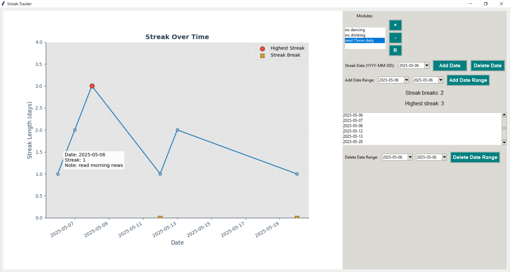

# Streak Tracker

This application allows you to track streaks for different modules with optional notes for each date.

## Features

- Add, delete, and rename modules.
- Add single dates or date ranges to streaks.
- Add optional notes to each date (limited to 50 characters) with real-time input length enforcement.
- Visualize streaks over time with highlights for highest streaks and breaks.
- Delete date ranges from streaks.
- Improved note input popup that truncates notes exceeding 50 characters as the user types without closing the input box or showing disruptive warnings.

## Screenshot



## Usage

Run the `streak_tracker.py` script to launch the application.

## Requirements

- Python 3.x
- tkinter
- matplotlib
- tkcalendar
- sqlite3 (standard with Python)

## Installation

Install required packages using pip:

```
pip install matplotlib tkcalendar
```

## License

MIT License
